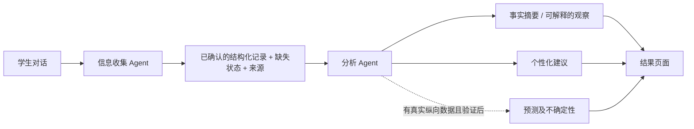

# 学生表现与 well-being 分析 Agent：历史设计草案 v0.1

**Current scope update (2026-09-19):** This draft predates the decision to remove academic-mark questions. Any references below to GPA collection, scoring, or prediction are superseded and must not be implemented in the active information-collection agent or result page. A limited local descriptive processor now exists for schema v2.0; see `ANALYSIS_AGENT_HANDOFF.md`. The broader methods in this historical draft still need revision and evaluation before implementation.

状态：**设计方案，尚未实现**。本文件在信息收集前端和接口完成后展开，供项目组讨论和后端组员衔接。它不把足球人格展示规则当作学术或健康评估模型。

## 1. 两个 Agent 的职责



收集 Agent 负责询问、澄清和记录；分析 Agent 负责检查输入、计算明确的派生量、生成有依据的解释，并在有足够数据及评估结果时才做预测。大语言模型可以组织语言，但**不能凭空填缺失值、编造模型分数、独自决定预测权重**。

## 2. 先明确输出，而不是先选算法

| 输出 | 当前所需信息 | MVP 可做什么 | 暂不可宣称什么 |
|---|---|---|---|
| 时间安排概况 | 学时、工作日/周末学习、课外活动、睡眠 | 计算每周自学时长、已报告的课内/课外时间；展示原始值和计算式 | 仅由时长判断学习效率、疲劳原因或因果关系 |
| 当前学业概况 | 当前 GPA、学时、自述课程困难 | 描述学生报告的 GPA 和时间安排，给出可执行的学习规划建议 | 在没有结局数据前预测下学期 GPA |
| 睡眠与生活节奏 | 睡眠时长、起床后感受 | 展示学生报告；在适用成人群体时提示“7 小时”参考值 | 根据这些字段诊断疾病或推断整体心理健康 |
| 当前 well-being | 目前收集的信息不足 | 明确显示“尚无法评估”；若项目组同意，可增加独立、经过许可的自评量表 | 把睡眠、GPA 或活动时长加权成“健康分” |
| 足球人格 | 演示用标签及项目定义 | 作为自我探索/游戏化展示，并标记为示意 | 把标签说成真实人格测量或教育决策依据 |
| Need Help? | 学生主动求助意向、校方核实的资源 | 提供经人工核实的资源入口 | 自动作出临床判断或紧急分流承诺 |

WHO 的 **WHO-5** 是一种以过去两周为回忆期、含五个条目的自评心理 well-being 工具；若未来纳入，应先确认使用许可、适用人群、展示方式和学校审查要求，并让它保持为独立的自评结果，而不是用现有四类时间数据去推断。[WHO-5 官方说明](https://www.who.int/publications/m/item/WHO-UCN-MSD-MHE-2024.01)

CDC 对 **18–60 岁成人**的通常建议是每晚至少 7 小时睡眠；这可以为合适人群提供背景解释，但不能单独构成诊断或学生级风险阈值。未确认年龄时，界面不应把该成人标准当成所有学生的统一判断。[CDC 睡眠说明](https://www.cdc.gov/sleep/about/)

## 3. 分析流水线

1. **输入门控**：验证 `schema_version`、字段、单位、值域、`status`、`source_turn`；拒绝冲突或不完整格式。保留 `unknown` / `declined`，不插补为平均值。
2. **适用性检查**：记录哪些分析可以做、哪些因缺失或不适用而不能做。若活动时间为 0，活动类型 `not_applicable` 不算缺失。
3. **确定性计算**：例如 `weekly_independent_study = 5 × weekday_study_hours + 2 × weekend_study_hours`；`reported_weekly_commitments = class_hours + activity_hours + weekly_independent_study`。所有数字可从原始字段复算。
4. **观察生成**：先用透明规则或经训练的模型生成结构化观察，每条观察引用字段和计算依据；再由语言模型将其改写成清晰、谨慎的学生可读文字。
5. **建议生成**：建议对应观察和学生偏好；使用“可以考虑……”等非诊断措辞。涉及校内支持时只引用已核实资源。
6. **输出校验**：检查每条陈述是否有字段来源，数值是否匹配，预测是否确实来自已评估模型，缺失值是否被错误使用。
7. **结果展示**：分开展示事实、观察、建议和预测状态；说明演示规则、未实现部分和不确定性。

## 4. 权重与算法怎么定

**现阶段建议不做单一“学生表现/健康综合分”。** 这四类输入不能充分测量 well-being，也没有项目数据证明任何固定权重合理。可先分别展示学业、时间安排、睡眠/主观感受，不把它们强行相加。

若未来确实需要权重，先确定其用途：

- **问询优先级权重**：只用于决定先追问哪一项，例如缺失的核心字段优先于可选细节；这是对话设计，不是学生健康评分。
- **建议排序权重**：根据学生明确的求助偏好、信息完整度、建议可执行性排序。权重须在项目组审查后写入版本化规则，并测试不同学生情境。
- **预测模型权重**：由有代表性、得到适当授权的历史数据学习，不能由 Agent 即兴给出。先建立简单可解释的基线模型（如正则化线性回归预测数值 GPA，或经校准的逻辑回归预测明确定义的二分类结局），再比较更复杂模型。模型的系数或特征贡献不等于因果效应。
- **量表分数**：若选用 WHO-5 等量表，按其正式说明计分，不与自制的 GPA/睡眠权重混在一起。使用条款与适用场景须先核实。[WHO-5 官方说明](https://www.who.int/publications/m/item/WHO-UCN-MSD-MHE-2024.01)

## 5. 如果将来要做真正的预测

先定义 **对象、时间点和结局**：例如“某学期开始收集资料，预测下一学期末的 GPA”。睡眠或 well-being 的未来预测必须另有明确、可重复测量的结局；仅有一次问卷不能验证这些预测。训练数据应与目标学生群体相符，并避免把未来信息泄漏进输入。

候选顺序：简单基线（例如预测训练集均值或当前 GPA）→ 正则化回归/校准分类 → 在足够样本和明确收益下比较树模型。按时间或学生划分训练与独立评估数据；报告缺失率、覆盖率、误差（GPA 可用 MAE）、分类校准与错误分布，并检查不同群体的差异。不要只展示一个“准确率”。对预测模型的开发和评估报告，可参考 TRIPOD+AI 的透明报告清单；它是报告指南，不替代模型质量评估。[TRIPOD+AI 原始指南](https://www.bmj.com/content/385/bmj-2023-078378)

**上线门槛**：数据来源和使用权限明确；结局定义合理；独立样本评估达到事先约定的水平；误差/校准和亚组表现可接受；不确定性与适用范围能在界面解释。未达到门槛时，预测区域继续显示“尚未提供”，不输出伪精确数字。NIST AI 风险管理框架强调有效性、可靠性、隐私和有害偏差管理，可作为项目评审框架。[NIST AI RMF 1.0](https://www.nist.gov/publications/artificial-intelligence-risk-management-framework-ai-rmf-10)

## 6. 建议的分析 Agent 输出契约

```json
{
  "analysis_schema_version": "0.1",
  "source_record_version": "1.0",
  "status": "descriptive_only",
  "derived_metrics": {
    "weekly_independent_study_hours": {"value": 11.5, "formula": "5*weekday_study_hours + 2*weekend_study_hours", "field_refs": ["weekday_study_hours", "weekend_study_hours"]}
  },
  "observations": [
    {"text": "The student reports 11.5 hours of independent study in a typical week.", "field_refs": ["weekday_study_hours", "weekend_study_hours"], "kind": "descriptive"}
  ],
  "advice": [],
  "predictions": {
    "future_gpa": {"status": "not_available", "reason": "No evaluated prediction model"},
    "future_sleep": {"status": "not_available", "reason": "No evaluated prediction model"},
    "future_wellbeing": {"status": "not_available", "reason": "No evaluated prediction model"}
  },
  "limitations": ["Self-reported information", "No health diagnosis"]
}
```

这是**接口草案**，不是当前代码已经返回的对象。最终字段名应与后端组员对齐。若没有可支持某项输出的资料，使用 `not_available` 和原因，不返回空想数值。

## 7. 隐私、人工审查和测试

GPA 和学生反馈属于需要谨慎处理的学生数据。美国教育部说明 FERPA 对教育记录及其中的个人身份信息披露提供保护；具体项目如何适用需由学校相关人员确认。原型应继续避免收集姓名和学号，限制本地数据库访问，确定保留期和删除办法。[美国教育部学生记录说明](https://www.ed.gov/about/contact-us/faqs/Student%20Records%20and%20Privacy)

测试至少覆盖：缺失/拒答、相互矛盾输入、超出值域、极端时间安排、不同 GPA 水平、不同活动参与情况、模型不适用、后端故障、Agent 编造数值、语言对学生造成误导的情况。请学生和校园支持领域人员评审可读性及资源建议。分析 Agent 的输出不应用于录取、奖惩或限制服务。

## 8. 项目组下一轮需要确认的四件事

1. 最重要的目标输出是什么：游戏化人格、学习规划建议、当前 well-being 自评，还是可验证的未来预测？
2. 是否有获得许可的纵向数据（同一学生的起点数据与后续 GPA/睡眠/well-being 结局）？没有则先做描述与建议。
3. 是否要加入 WHO-5 或其他独立 well-being 自评工具？由谁审查量表许可、适用对象和校园资源？
4. 学生是否能够查看、纠正、删除自己的记录？学校对数据保留和共享有什么要求？
