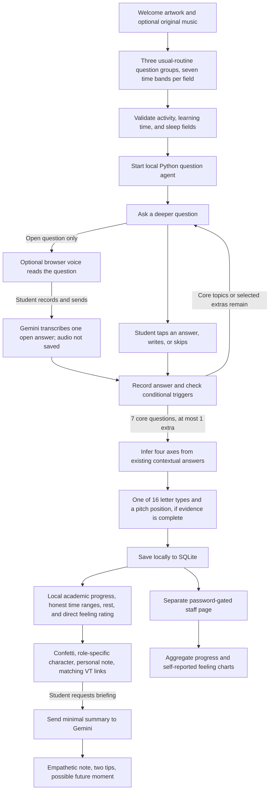

# WPTI current flow

Question selection and arithmetic analysis are local Python. Selected time intervals are retained and derived weekly intervals are calculated from their bounds; internal midpoints are estimates, not exact reports. Optional voice answers send only one short recording to Gemini after a separate student action. The optional result briefing sends a compact range summary after the student clicks its button; it does not send the transcript or raw replies. The staff page reads local saved results and displays aggregate self-reports. These are not validated predictions. No agent asks questions about academic marks.
