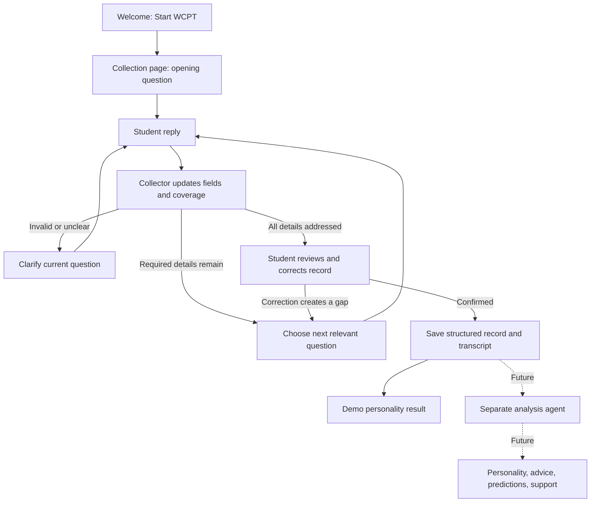

# WCPT current and future flow

The collector is currently a transparent rule-based demo. The future backend agent will replace it through `collection_gateway.py`. The separate analysis agent is planned but not implemented.
