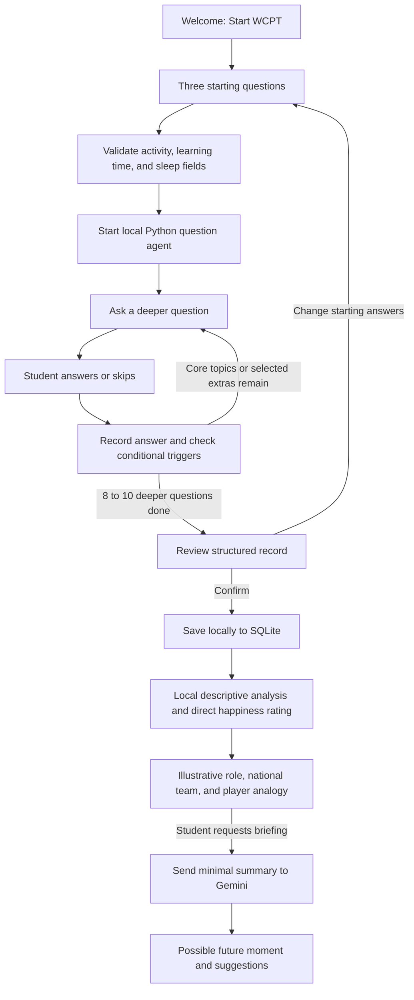

# WCPT current flow

Question selection and arithmetic analysis are local Python. The optional Gemini request sends a compact numeric summary after the student clicks the briefing button; it does not send the transcript or raw replies. No agent asks questions about academic marks.
